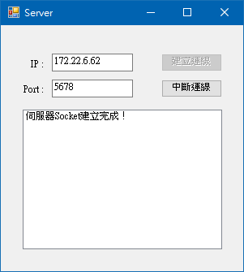
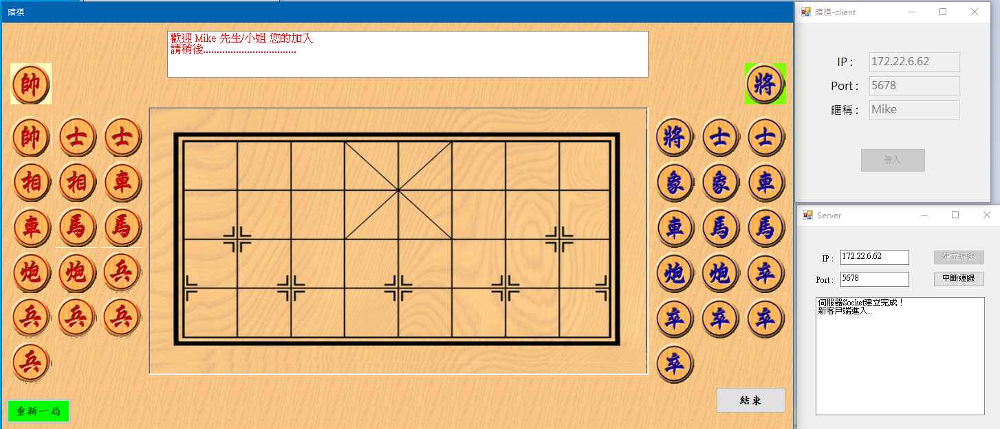
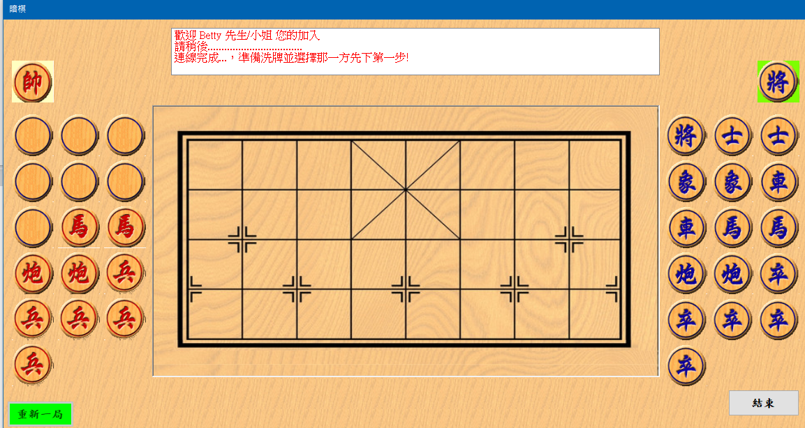
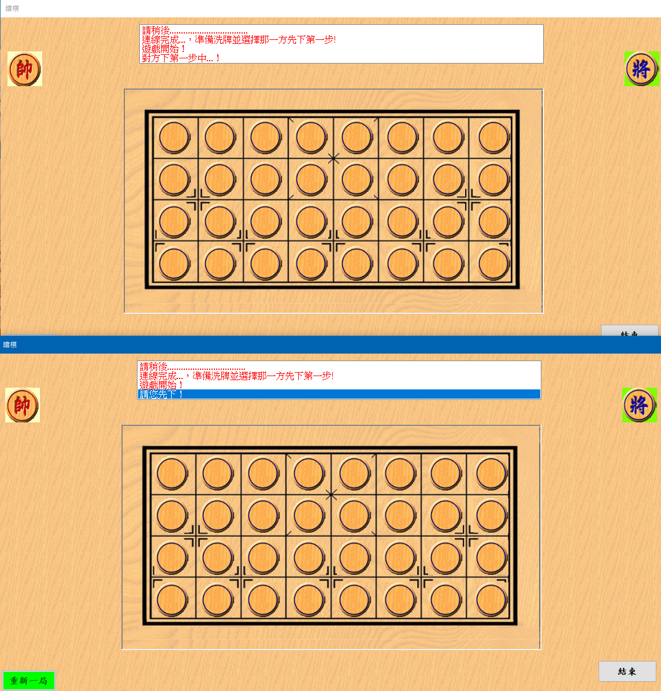

# 暗棋

本遊戲是用C#撰寫。用tcp socket通訊，分別有sever及client程式。可多組人同時玩。

1. 開啟SKServer.exe，輸入ip及listen port後按建立連線。
   
2. 開啟暗棋.exe，輸入Server的 ip、port no和自己稱呼。
   
3. 此時會等待另一個player。
   
4. 和2一樣，再開一個暗棋client。連線server後，會開始洗牌。之後server會挑一位player先下第一步。
   
5. Server會動態挑選誰先下並選o或x。位置選定後按選擇確定。也會在對方盤面顯示。
   
6. 經過幾步後...
   

   
